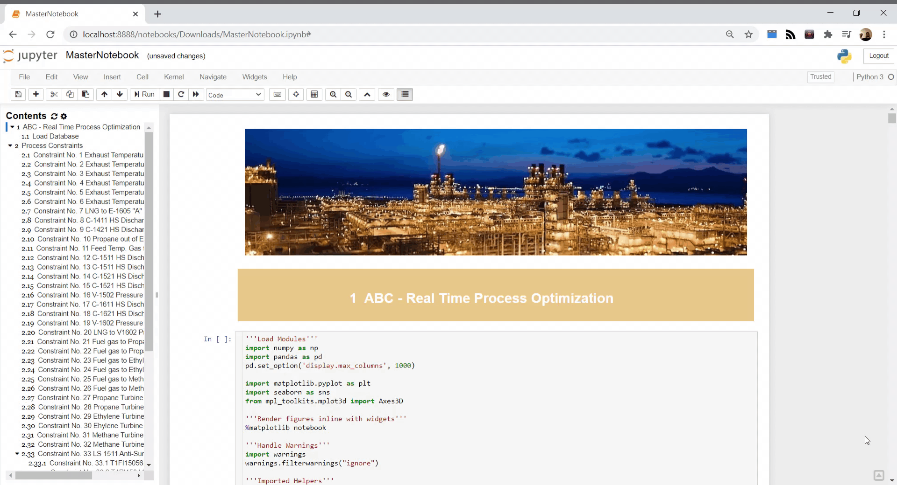

Jupyter notebooks are great. Among the other benefits of using them, I often find they are simple but great tool for working in projects that involve close collaborations with domain experts, process engineers etc. You can keep all of your models in one place, record the outcomes of numerical experiments, jot down your notes etc. I often try to compile exploratory analysis, model building and analysis of the results into a single notebook. This helps in working iteratively with the other team members, communicating ideas and helps maintain the *story* of the project eg. what key finding in the data lead to certain choices in model building etc. Most importantly I find them helpful to work in an organized manner.    

However, it was quite unlike this when I started using Jupyter notebooks initially. I would find myself endlessly scrolling and searching for specific figure, model, code cell etc, until, I found certain jupyter notebook extensions that did exactly what I was looking for. In this post, I am going to share about these extensions and some other tips that help me work efficiently in a long jupyter notebook.  The information about how to install jupyter notebook extensions can be found  [here](https://jupyter-contrib-nbextensions.readthedocs.io/en/latest/install.html). 

**1. Initialization Cells**

   

 

**2. Table of Contents**

**3. Scratchpad**

